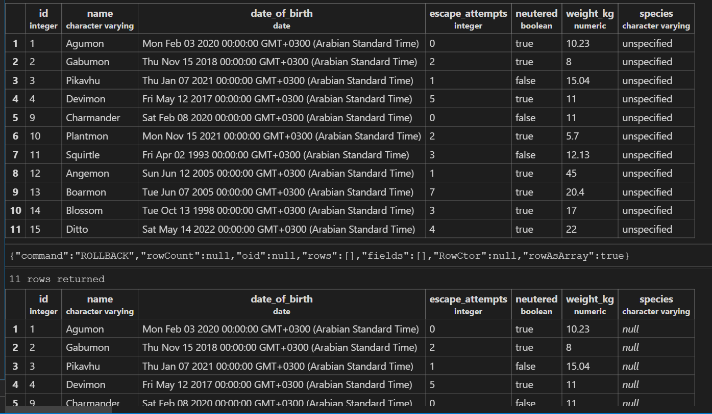
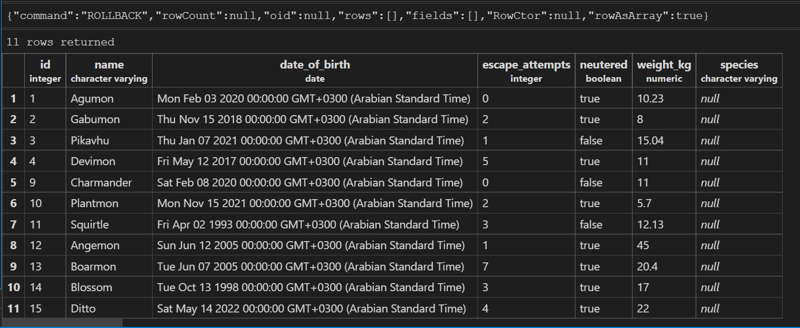
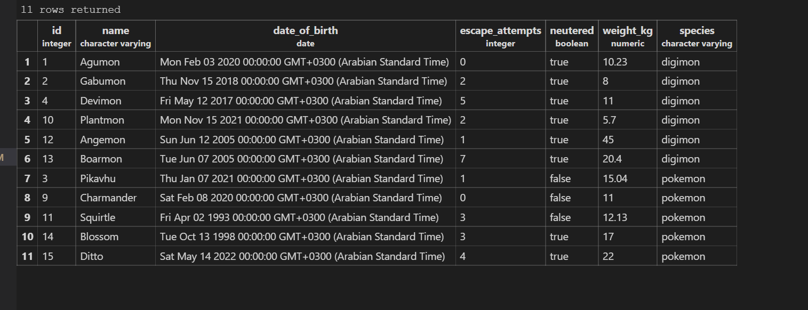
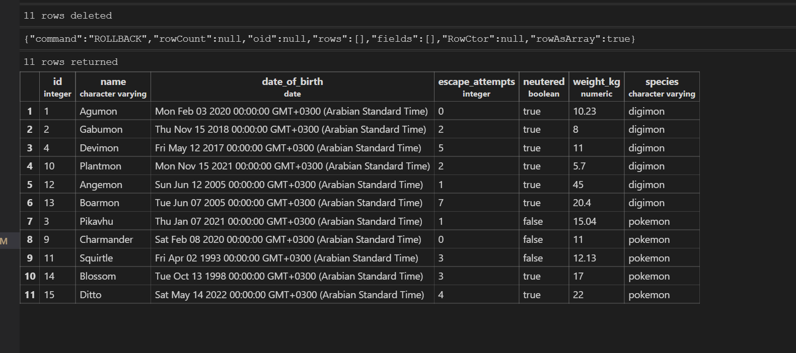
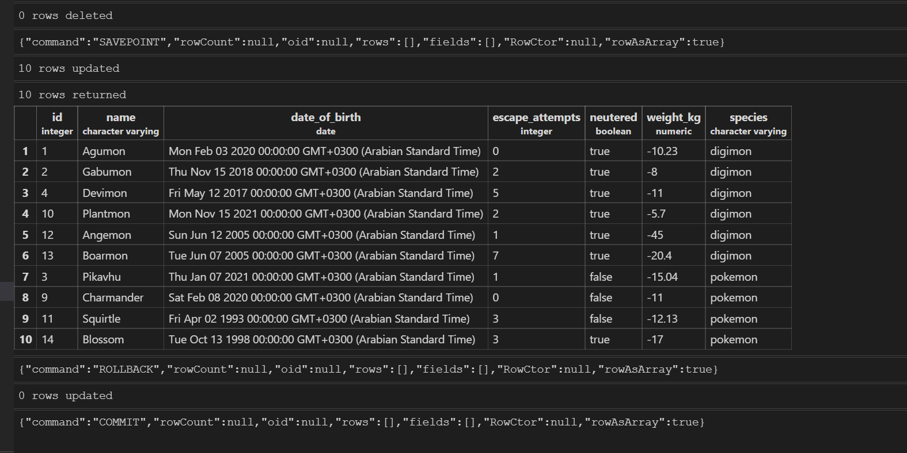
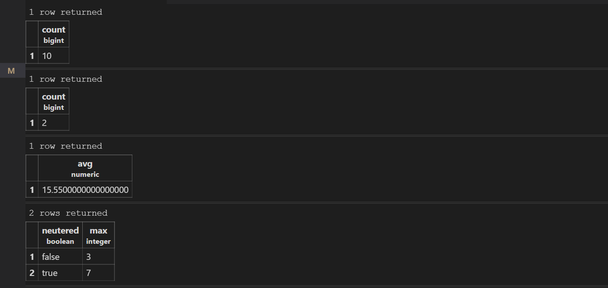

# Vet clinic database: query and update animals table.

## Getting Started

This repository includes files with plain SQL that can be used to recreate a database:

- Use [schema.sql](./schema.sql) to create all tables.
- Use [data.sql](./data.sql) to populate tables with sample data.
- Check [queries.sql](./queries.sql) for examples of queries that can be run on a newly created database. **Important note: this file might include queries that make changes in the database (e.g., remove records). Use them responsibly!**

### ScreenShots:

## Author

👤 **Ibrahim Ahmat**

- GitHub: [@ibr5500](https://github.com/ibr5500)
- Twitter: [@ibr_ahmat](https://twitter.com/ibr_ahmat)
- LinkedIn: [LinkedIn](https://www.linkedin.com/in/ibrahim-ahmat/)

## 🤝 Contributing

Contributions, issues, and feature requests are welcome!

Feel free to check the [issues page](../../issues/).

## Show your support

Give a ⭐️ if you like this project!

## Acknowledgments

- Hat tip to anyone whose code was used
- Inspiration
- etc

## 📝 License

This project is [MIT](./MIT.md) licensed.
